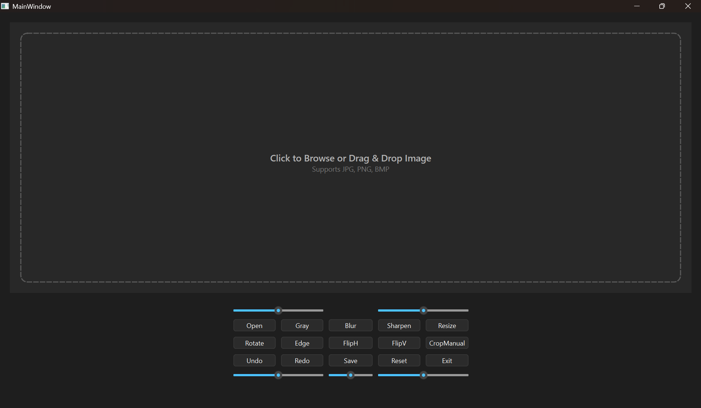

# 🖼️ Susovan Image Processing Tool

A modern C++ image processing desktop application built using **Qt Framework**.  
This tool provides real-time image manipulation with an intuitive UI and drag-and-drop support.

---

## 🚀 Features

- 📂 Open / Save Images
- 🎯 Drag & Drop Image Support
- 🌈 Grayscale Conversion
- 🔍 Blur & Sharpen Filters
- 🔄 Rotate / Flip (Horizontal & Vertical)
- ✂️ Manual Crop
- 📏 Resize Image
- 🧠 Undo / Redo Support
- 🎛️ Brightness & Contrast Controls
- 🎨 Cinematic Color Adjustment

---

## 🖥️ UI Preview

### Main Interface


---

## 🧪 Sample Images

Test images are available inside:

test_images/


---

## ⚙️ Tech Stack

- C++
- Qt 6
- OpenCV (if used)
- CMake

---

## 🛠️ Build Instructions

```bash
git clone https://github.com/SusovanGit10/CODSOFT_Susovan_Image_Processing_Tool.git
cd CODSOFT_Susovan_Image_Processing_Tool
mkdir build
cd build
cmake ..
cmake --build .
📌 Project Highlights
Custom drag-and-drop UI
Modern dark theme interface
Efficient image processing pipeline
Clean modular C++ design
📜 License

This project is licensed under the MIT License.

👨‍💻 Author

Susovan Hati


---